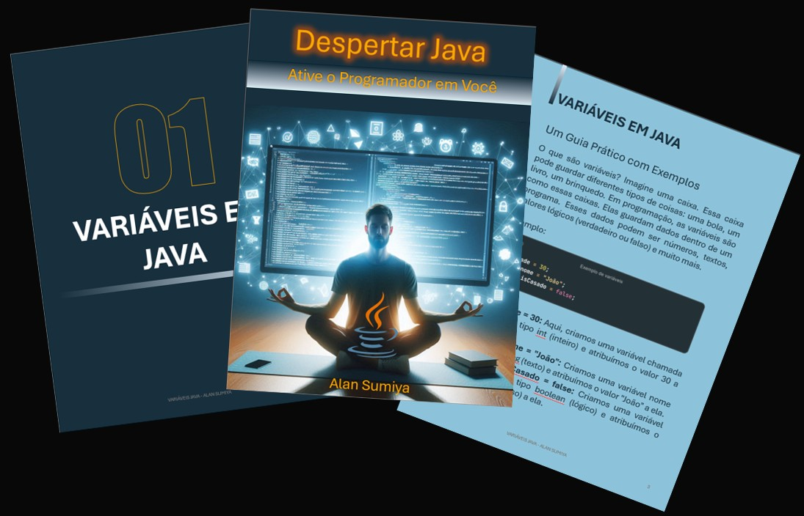

    

-------

# Projeto EBOOK Gerado por I.A.s

 > ℹ️ **NOTE:** Este é o repositório desenvolvido durante o curso no qual fui instrutor técnico na plataforma da [DIO](https://dio.me)

Projeto com o objetivo de gerar um ebook digital com as facilidades das ferramentas de IA. todos os prompts
seguem abaixo.

<a href="https://github.com/alansumiya/prompts-recipe-to-create-a-ebook/blob/main/output/Capa%20Ebook.pdf" title="View PDF now"> 📕Clique aqui para ler</a>

## 💻 Tecnologias utilizadas no projeto

- [Gemini](https://gemini.google.com) 
- [Copilot](https://copilot.microsoft.com)
- [PowerPoint](https://www.microsoft.com/en/microsoft-365/powerpoint)

## 🧠 Prompts

Gemini：

|   Ação   | prompt                                                                                                                                                                                                                                                                         |
| :------: | ------------------------------------------------------------------------------------------------------------------------------------------------------------------------------------------------------------------------------------------------------------------------------ |
|  título  | Crie um título de um ebook sobre o tema java, o ebook é do nicho de programação e o subnicho é de java, o título deve ser épico e curto. Me liste 5 variações de títulos                                                        |
| conteúdo | Faça um texto para ebook , com foco em java, listando as principais variáveis com exemplos em código {REGRAS} Explique sempre de uma maneira simples Deixe o texto enxuto, Sempre traga exemplos de código em contextos reais , sempre deixe um título sugestivo por tópico |

Copilot：

|  Ação  | prompt                                                                                 |
| :----: | -------------------------------------------------------------------------------------- |
| título | gerar uma imagem de um programador meditando para obter o despertar de programar       |

## ✨ Features

- Conteúdo gerado via Gemini
- Imagens geradas via Copilot

## 📚 Materiais

- Imagens utilizadas em `assets`
- ebook gerado durante as aulas em `output`

## 🛠️ Instruções de execução

Utilize os prompts acima nas ferramentas sugeridas para gerar o material base e utilize uma ferramenta de edição de documentos como power point, libreoffice , indesign para diagramação.

## 👨‍💻 Beginner

    
    
&nbsp&nbsp&nbspAlan Sumiya 
    &nbsp&nbsp&nbsp
    <a href="https://github.com/alansumiya">
    GitHub</a>&nbsp;|&nbsp;
    <a href="https://www.linkedin.com/in/alan-sumiya/">LinkedIn</a>
&nbsp;|&nbsp;
    <a href="https://www.instagram.com/alansumiya/">
    Instagram</a>
&nbsp;|&nbsp;

  

---

⌨️ Por [Alan Sumiya](https://github.com/alansumiya)
